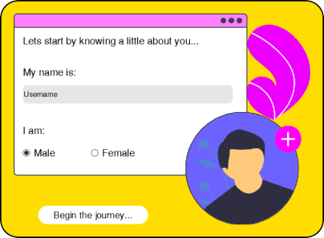

# Prioritize 📝
Your personal To-Do List App!!!

Created by using Qt Designer and PyQt5 this app brings a modern look and feel to the UI unlike apps made using Tkinter that have a stock UI

## The Need 
This app was created to make the user productive by assisting the user with notifications and to experiment with the module PyQt5 and create a desktop application 

## Modules used 
The modules used for this project were `os` `sys` `sqlite3` `datetime` `time` `getpass` and `PyQt5`

## Snaps of UI

  
  
Login UI

  
  
Task Adding and Editing UI

  
  
Dashboard UI

